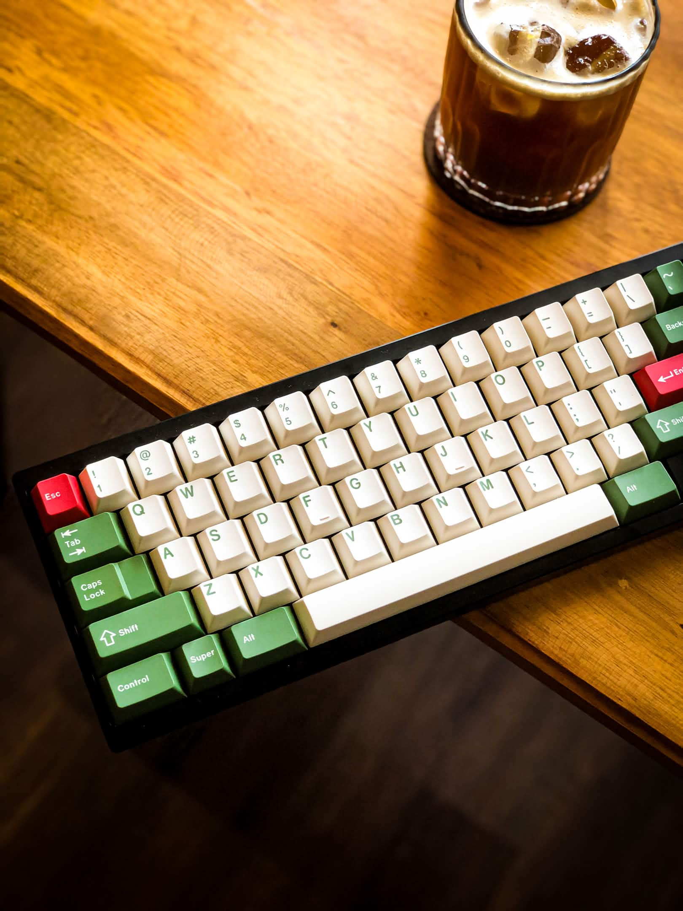
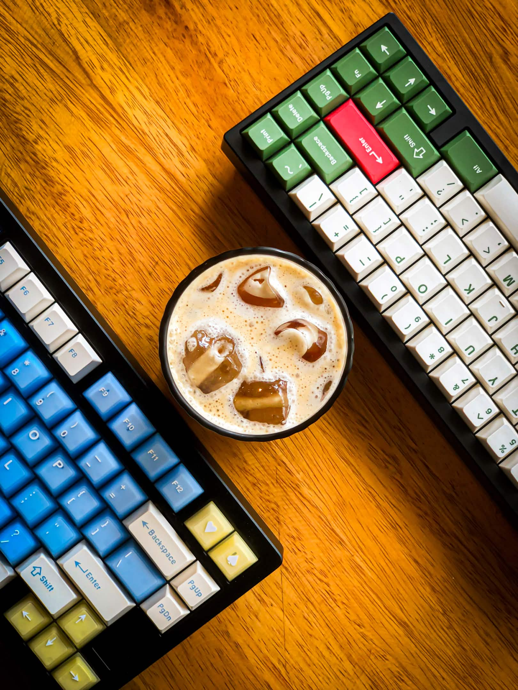

  

# Hi there, I'm Vincentius Edward 👋

 

---

## 🚀 About Me

I'm a **fresh graduate from Hacktiv8** specializing in **Fullstack Development**.  
I enjoy building modern web and mobile applications, learning new technologies, and solving real-world problems through code.

---

# 🛠 Tech Stack

### 💻 Languages

<table align="center">
  <tr>
    <td align="center" style="padding:14px 18px;">
      
       TypeScript
    </td>
    <td align="center" style="padding:14px 18px;">
      
       JavaScript
    </td>
    <td align="center" style="padding:14px 18px;">
      
       Git
    </td>
    <td align="center" style="padding:14px 18px;">
      
       MySQL
    </td>
  </tr>
</table>

### 🎨 Frontend

<table align="center">
  <tr>
    <td align="center" style="padding:14px 18px;">
      
       React
    </td>
    <td align="center" style="padding:14px 18px;">
      
       Next.js
    </td>
    <td align="center" style="padding:14px 18px;">
      
       Redux
    </td>
    <td align="center" style="padding:14px 18px;">
      
       Tailwind
    </td>
    <td align="center" style="padding:14px 18px;">
      
       HTML
    </td>
    <td align="center" style="padding:14px 18px;">
      
       CSS
    </td>
  </tr>
  <tr>
    <td align="center" style="padding:14px 18px;">
      
       React Native
    </td>
    <td align="center" style="padding:14px 18px;">
      
       Apollo
    </td>
    <td align="center" style="padding:14px 18px;">
      
       Axios
    </td>
  </tr>
</table>

### ⚙️ Backend

<table align="center">
  <tr>
    <td align="center" style="padding:14px 18px;">
      
       Node.js
    </td>
    <td align="center" style="padding:14px 18px;">
      
       Express
    </td>
    <td align="center" style="padding:14px 18px;">
      
       PostgreSQL
    </td>
    <td align="center" style="padding:14px 18px;">
      
       MongoDB
    </td>
    <td align="center" style="padding:14px 18px;">
      
       Firebase
    </td>
    <td align="center" style="padding:14px 18px;">
      
       GCP
    </td>
    <td align="center" style="padding:14px 18px;">
      
       AWS
    </td>
  </tr>
  <tr>
    <td align="center" style="padding:14px 18px;">
      
       Sequelize
    </td>
    <td align="center" style="padding:14px 18px;">
      
       Socket.IO
    </td>
    <td align="center" style="padding:14px 18px;">
      
       GraphQL
    </td>
  </tr>
</table>

# 🌐 Connect With Me

<table align="center">
  <tr>
    <td align="center" style="padding:14px 18px;">
      
    </td>
    <td align="center" style="padding:14px 18px;">
      
    </td>
    <td align="center" style="padding:14px 18px;">
      
    </td>
    <td align="center" style="padding:14px 18px;">
      
    </td>
    <td align="center" style="padding:14px 18px;">
      
    </td>
  </tr>
</table>

---

# ⚡ Fun Fact About Me

I really love making custom keyboards on my free time ⌨️

<table align="center">
  <tr>
    <td align="center">
      
    </td>
    <td align="center">
      
    </td>
  </tr>
</table>

---

### ✨ Thanks for visiting my profile ✨

